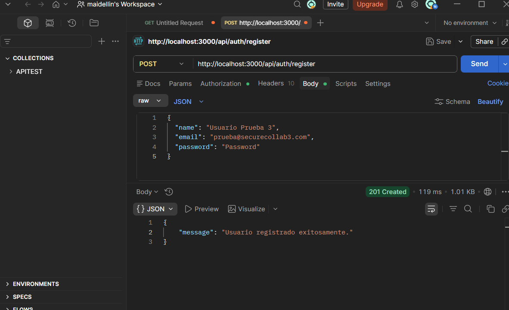
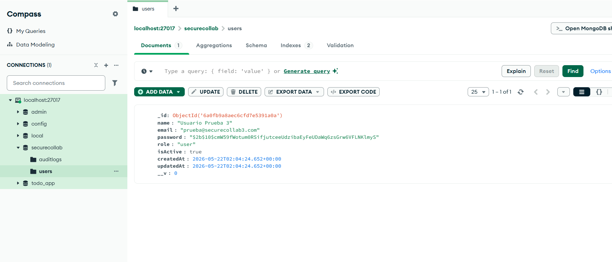
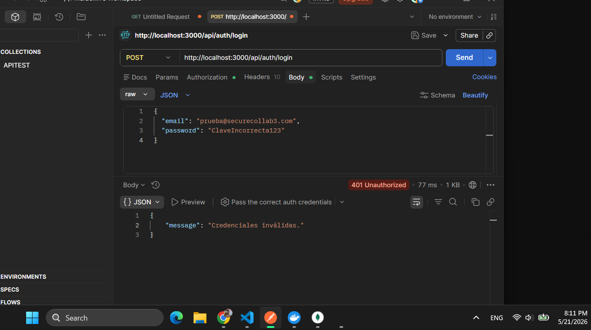
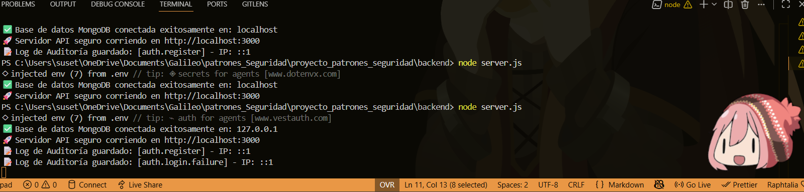
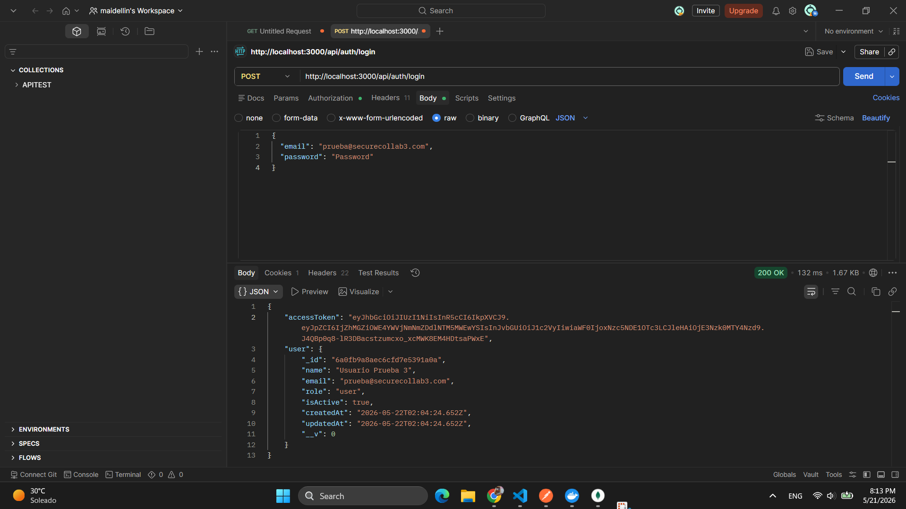
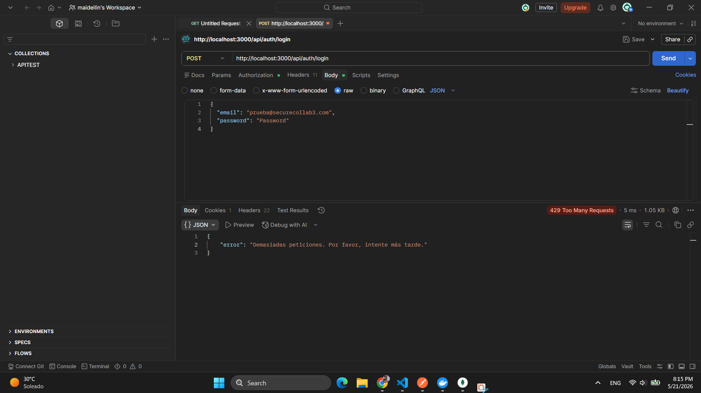
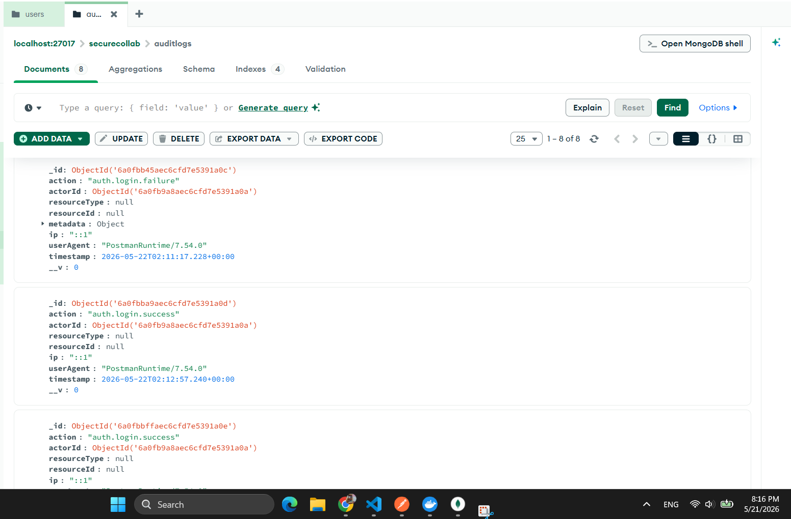

Imagen 1 creacion de usuario 
  

Imagen 2 base de datos corriendo en  mongo
  

  Imagen 3 
  credenciales invalidas al hacer login  y el log que se ha detectado de la sesion fallida 
  

imagen 4 
inicio de sesion exitoso con el usuario y contrasena anterior:

imagen  5 
demasiadas peticion de login contrasena correcta o incorrecta

imagen  6 
en mongo tenemos el audit log 
