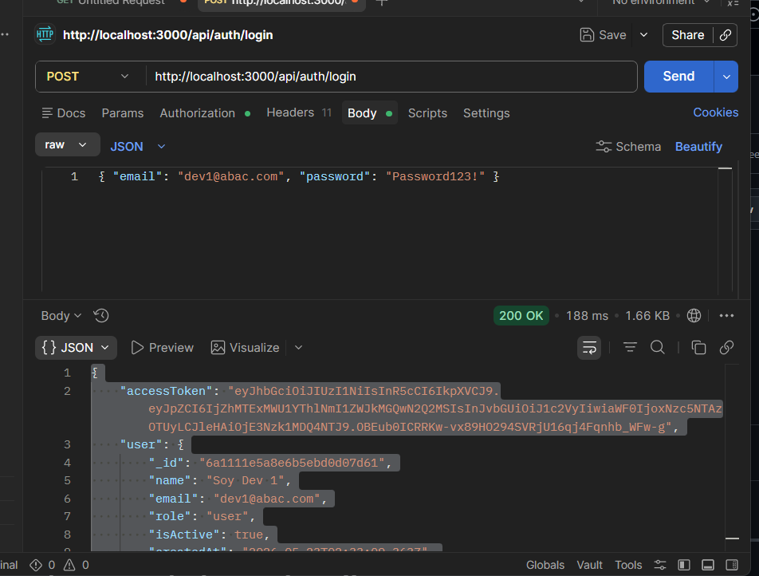
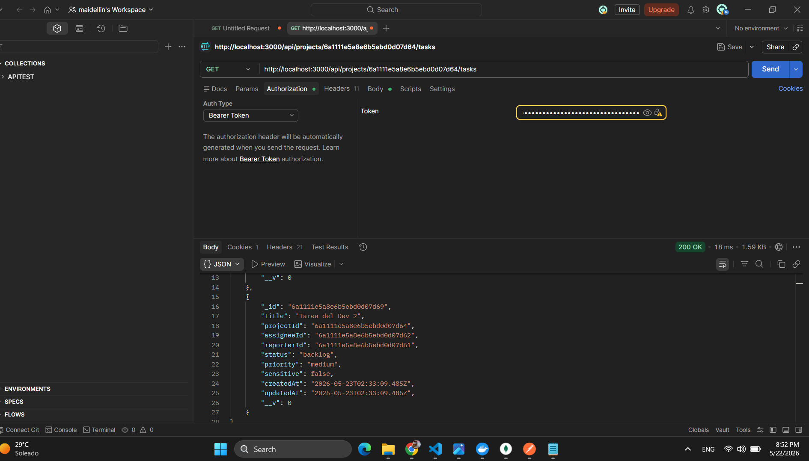
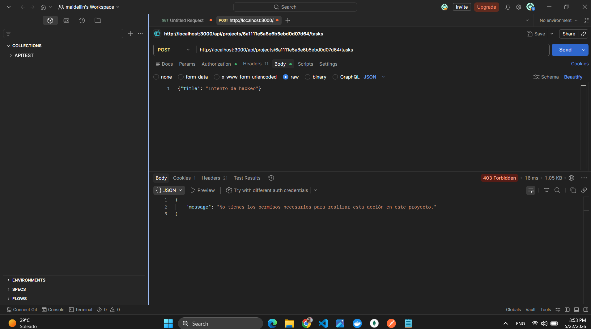
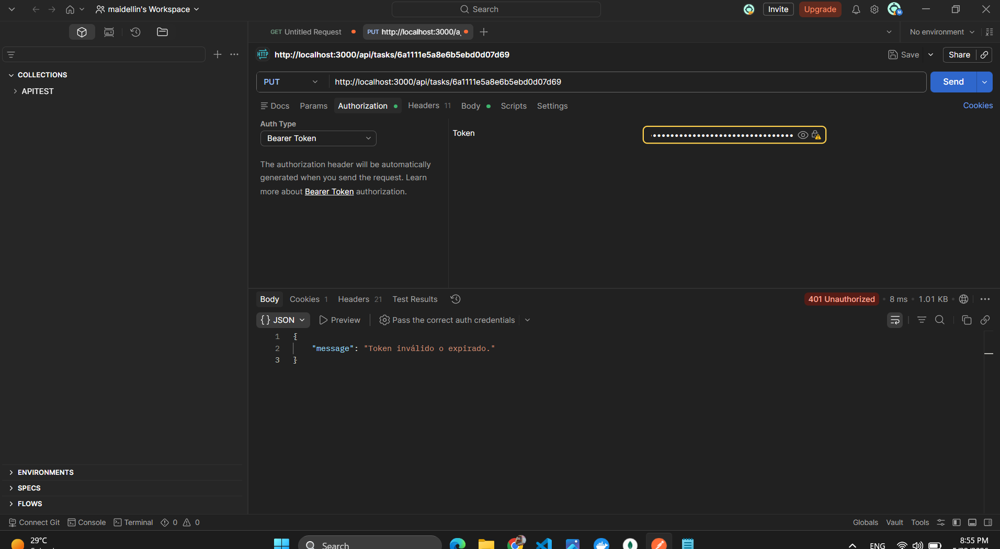

imagen 1

Creamos dos usuarios 

Imagen 2 

Esta petición demuestra la evaluación exitosa de atributos. El middleware interceptó la solicitud, consultó la colección Membership y confirmó que el usuario posee el rol viewer dentro de este proyecto específico. La política canReadTask permite la lectura a este rol, por lo que el acceso fue concedido 
iniciamos sesion con un usuario especifico autenticamos y vemos las tareas

imagen 3
Aunque el usuario tiene un token JWT válido , su membresía indica que es un viewer. Dado que la política canCreateTask exige estricta y únicamente los roles developer o project_admin, la petición es bloqueada a nivel de middleware devolviendo un HTTP 403 (Forbidden), evitando que la lógica del controlador llegue a ejecutarse.

imagen  5
 El usuario es un developer del proyecto, por lo que pasa el primer filtro. Sin embargo, la política canEditTask evalúa un atributo del recurso: compara el ID del usuario que hace la petición con el assigneeId de la tarea. Al no coincidir (es decir, la tarea le pertenece a otro desarrollador), la transacción se deniega (HTTP 403). El acceso se decidió por el contexto del dato, no solo por el rol.
