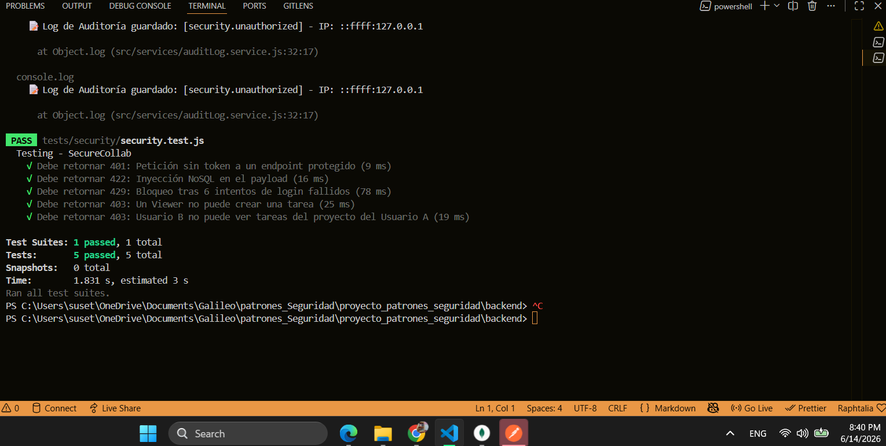

Prueba 1 - Se envía una petición a un endpoint de la organización sin proporcionar el token JWT en las cookies. El sistema mitiga correctamente la vulnerabilidad retornando un código de estado 401 Unauthorized.

Prueba 2 -  Verifica la robustez de la validación de entrada de datos. Se inyecta un operador malicioso de MongoDB ($gt) en el payload de autenticación simulando un ataque. La API intercepta el esquema inválido y retorna un estado 422 Unprocessable Entity. 

 Prueba 3 -  Comprueba la efectividad de la política de Rate Limiting. Se simulan peticiones sucesivas al endpoint de inicio de sesión. Al detectar el sexto intento fallido consecutivo proveniente de la misma IP, el servidor bloquea la solicitud respondiendo con un 429 Too Many Requests y el respectivo encabezado Retry-After. 
 
  Prueba 4 -  Evalúa la correcta aplicación de las reglas ABAC en los roles de contexto. Se autentica a un usuario con rol de viewer y se intenta ejecutar una petición POST para crear una tarea, acción reservada para developer o project_admin. El guardián de permisos intercepta la petición y retorna un 403 Forbidden. 
  
Prueba 5 - Asegura el aislamiento de datos entre organizaciones y proyectos distintos. Se autentica a un "Usuario B" y se intenta realizar una petición GET para leer las tareas de un proyecto al cual no pertenece ni ha sido invitado. El sistema valida la carencia de membresía y prohíbe la lectura devolviendo un

