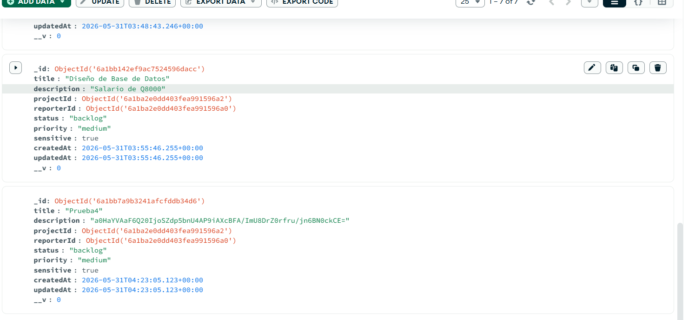
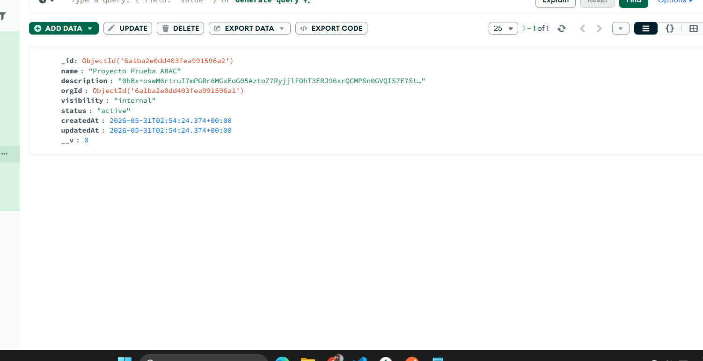
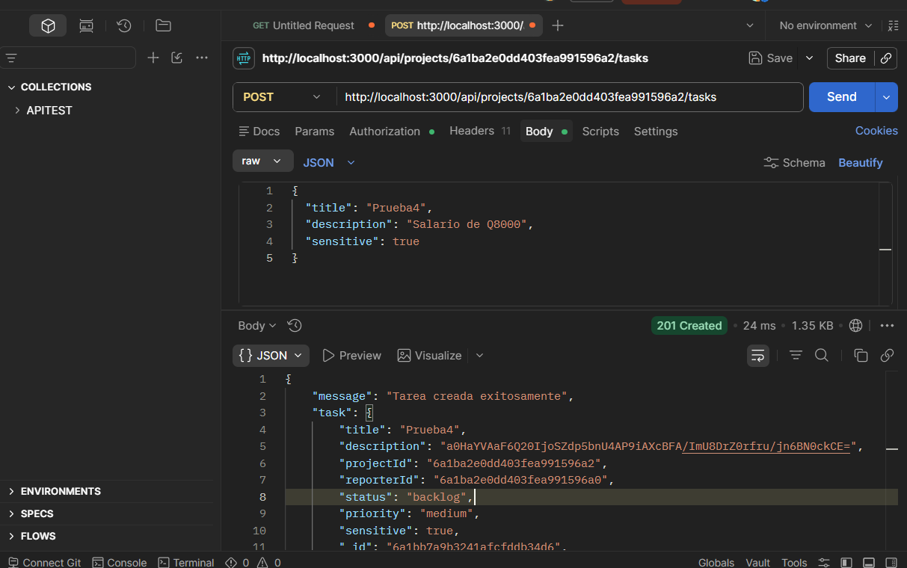

## Screenshot 1: documento cifrado en MongoDB Compass
Evidencia de la base de datos en MongoDB Compass (colección `projects`). Se observa el documento del proyecto donde el campo `description` se encuentra almacenado como una cadena cifrada en Base64. Esto demuestra la correcta implementación del cifrado en reposo, garantizando que un acceso directo a la base de datos no revele información confidencial.

## Screenshot 2:
Respuesta `200 OK` obtenida mediante Postman al consumir el endpoint `GET /api/projects/:id`. Se demuestra que la API es capaz de leer el documento cifrado de la base de datos, procesarlo a través de la función de descifrado en el controlador y devolver el campo `description` en texto plano ("Proyecto generado por seed para pruebas") de forma transparente para el cliente autorizado.

## Screenshot 3: task con sensitive=true cifrado
Evidencia en la colección `tasks` de MongoDB Compass. Muestra un documento de tarea insertado con el atributo `sensitive: true`. Se comprueba que el hook `pre('save')` de Mongoose interceptó correctamente el documento antes de la inserción y aplicó el algoritmo de cifrado exclusivamente al campo `description`, cumpliendo con la lógica de confidencialidad condicional.

## Curl del GET por API mostrando descifrado

curl --location 'http://localhost:3000/api/projects/6a1ba2e0dd403fea991596a2' \
--header 'Authorization: Bearer [TU_TOKEN]'

→ { 
  "_id": "6a1ba2e0dd403fea991596a2",
  "name": "Proyecto Prueba ABAC",
  "description": "Proyecto generado por seed para pruebas",
  "orgId": "6a1ba2e0dd403fea991596a1",
  "visibility": "internal",
  "status": "active",
  "createdAt": "2026-05-31T02:54:24.374Z",
  "updatedAt": "2026-05-31T02:54:24.374Z",
  "__v": 0
}